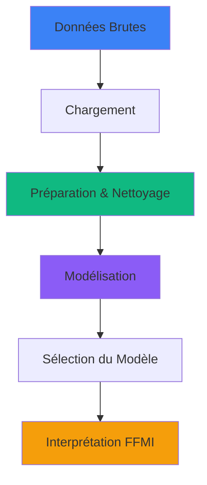

<!-- Auteur : Lesueur Romain -->

<!-- En-tête avec gradient -->

### **Projet de Statistiques : Modélisation de l'Indice de Masse Graisseuse (FFMI)**

  
  
  
  

 

<!-- Badges des technologies -->

  
  
  

 

---

## Description du projet

<table>
<tr>
<td width="70%">

Analyse statistique complète pour déterminer le meilleur modèle de régression linéaire permettant de prédire l'**Indice de Masse Sans Graisse (FFMI)**. Le projet explore la corrélation entre les mesures corporelles (cou, poitrine, abdomen, hanches) et l'indice cible afin d'identifier les variables les plus prédictives.

### Objectifs principaux

- **Identifier** les meilleures variables corporelles prédictives du FFMI
- **Construire** un modèle de régression linéaire robuste et interprétable
- **Traiter** les valeurs atypiques pour garantir la qualité des données
- **Visualiser** les corrélations et distributions via ggplot2

</td>
<td width="30%">

</td>
</tr>
</table>

### Variable Cible

| Variable | Signification | Type |
|----------|---------------|------|
| **FFMI** | Fat-Free Mass Index — Indice de Masse Sans Graisse | Quantitative continue |

---

## Architecture du projet

Le projet est organisé en **3 phases principales** correspondant au pipeline d'analyse statistique :

 

<table>
<thead>
<tr>
<th width="5%">#</th>
<th width="25%">Phase</th>
<th width="45%">Tâches réalisées</th>
</tr>
</thead>
<tbody>

<!-- PHASE 1 : CHARGEMENT -->
<tr>
<td colspan="3" align="center" style="background-color:#3B82F6; color:white;"><b>PHASE 1 : Chargement des données</b></td>
</tr>
<tr>
<td align="center"><b>1</b></td>
<td><b>Data Loading</b></td>
<td>
• Import du jeu de données des mesures corporelles 
• Inspection de la structure et des types de variables 
• Analyse descriptive initiale (min, max, moyenne, écart-type)
</td>
</tr>

<!-- PHASE 2 : PREPARATION -->
<tr>
<td colspan="3" align="center" style="background-color:#10B981; color:white;"><b>PHASE 2 : Préparation des données</b></td>
</tr>
<tr>
<td align="center"><b>2</b></td>
<td><b>Data Preparation</b></td>
<td>
• Détection et traitement des valeurs atypiques (outliers) 
• Vérification des hypothèses de normalité 
• Analyse des corrélations entre variables corporelles 
• Visualisation des distributions avec ggplot2
</td>
</tr>

<!-- PHASE 3 : MODELISATION -->
<tr>
<td colspan="3" align="center" style="background-color:#8B5CF6; color:white;"><b>PHASE 3 : Modélisation statistique</b></td>
</tr>
<tr>
<td align="center"><b>3</b></td>
<td><b>Modeling & Sélection</b></td>
<td>
• Construction de plusieurs modèles de régression linéaire 
• Exploration des variables : cou, poitrine, abdomen, hanches 
• Évaluation des modèles (R², RMSE, résidus) 
• Sélection du meilleur modèle prédictif 
• Interprétation des coefficients
</td>
</tr>

</tbody>
</table>

---

## Variables explorées

<table>
<tr>
<td align="center" width="25%">
<h3>🔵 Cou</h3>
  
Circonférence cervicale
</td>
<td align="center" width="25%">
<h3>🟢 Poitrine</h3>
  
Tour de poitrine
</td>
<td align="center" width="25%">
<h3>🟣 Abdomen</h3>
  
Tour abdominal
</td>
<td align="center" width="25%">
<h3>🟡 Hanches</h3>
  
Tour de hanches
</td>
</tr>
</table>

---

## Métriques d'évaluation

<table>
<tr>
<td align="center" width="33%">
<h3>Qualité du modèle</h3>
 

</td>
<td align="center" width="33%">
<h3>Erreur de prédiction</h3>
 

</td>
<td align="center" width="33%">
<h3>Hypothèses</h3>
 

</td>
</tr>
</table>

---

## Stack Technologique

<table>
<tr>
<td align="center" width="25%">
<h3>Langage</h3>

</td>
<td align="center" width="25%">
<h3>Visualisation</h3>

</td>
<td align="center" width="25%">
<h3>Modélisation</h3>

</td>
<td align="center" width="25%">
<h3>Domaine</h3>

</td>
</tr>
</table>

---

## Livrables du projet

<table>
<thead>
<tr>
<th width="40%">Livrable</th>
<th width="25%">Format</th>
<th width="35%">Statut</th>
</tr>
</thead>
<tbody>
<tr>
<td><b>Script d'analyse complet</b></td>
<td>.R / .Rmd</td>
<td></td>
</tr>
<tr>
<td><b>Visualisations ggplot2</b></td>
<td>PNG / PDF</td>
<td></td>
</tr>
<tr>
<td><b>Modèle de régression final</b></td>
<td>.RData / .rds</td>
<td></td>
</tr>
<tr>
<td><b>Rapport d'analyse statistique</b></td>
<td>PDF / HTML (knitr)</td>
<td></td>
</tr>
</tbody>
</table>

---

## Contact

Pour toute question concernant ce projet :

<table>
<tr>
<td align="center" width="50%">

  
<h3>Romain Lesueur</h3>

Modélisation statistique & Régression
</td>
</tr>
</table>

---

### Informations du projet

**Projet de Statistiques — 2024**
*Modélisation de l'Indice de Masse Graisseuse par régression linéaire*

 

---

<!-- Footer avec vague -->

© 2024 - Projet académique - Tous droits réservés
 
Romain Lesueur

